## Section 1: What This Is

This is a payments and subscriptions slice: a signed-in user can look at three plans (Free, Monthly, Yearly), subscribe to one through a real Paystack checkout, and afterwards see their billing status, including current plan, renewal date, and any pending changes. From there they can upgrade from monthly to yearly, downgrade from yearly to monthly, or cancel outright. Upgrading charges the yearly price right away, but first works out how many days are left on the current monthly period, turns that into a naira credit for the unused time, and subtracts it from the yearly price before charging. Downgrading and cancelling both take effect at the end of the current paid period instead of cutting off access immediately. Every payment, whether it succeeds or fails, is written to an append only log rather than just updating a status column, and the plan a user actually gets is decided by the server after independently verifying the payment with Paystack, never by trusting whatever the browser reports on redirect.

Deliberately left out: no landing page or pricing marketing page, no product features gated behind the paid plans. A subscription here is just a plan flag on the user's record, not a door to real functionality. There's also no in app card entry; card details are collected entirely inside Paystack's hosted checkout, so this app never touches raw card data. Account creation and sign in are reused as is from Assessment 1's auth slice rather than rebuilt, since this assessment's brief is specifically about the payments/subscriptions engineering, not auth.

## Section 2: How To Run It

What to install:
- [Node.js](https://nodejs.org) (v20 or later)
- The [Supabase CLI](https://supabase.com/docs/guides/cli) (installed automatically as a project dependency, no separate install needed)
- A [Paystack](https://paystack.com) account in test mode, with a Monthly and a Yearly Plan created under Payments -> Plans

Steps from a fresh clone:

1. `npm install`
2. Copy `.env.example` to `.env` and fill in `VITE_API_BASE_URL`, which is `https://<your-project-ref>.supabase.co/functions/v1`, found in the Supabase dashboard under Project Settings -> General
3. `npx supabase login` (opens a browser to authorize the CLI with your Supabase account)
4. `npx supabase link --project-ref <your-project-ref>` (prompts for your project's database password)
5. `npx supabase db push`, which applies the migrations in `supabase/migrations/` to create the users, subscriptions, payment_log and webhook_events tables
6. `npx supabase functions deploy`, which deploys all 15 Edge Functions (the auth functions reused from Assessment 1, plus checkout-init, verify-payment, paystack-webhook, billing-status, upgrade-subscription, downgrade-subscription and cancel-subscription)
7. Set the required secrets: `npx supabase secrets set PAYSTACK_SECRET_KEY=<your-test-secret-key> BREVO_API_KEY=<your-key> EMAIL_FROM=<your-verified-sender>`. The Paystack secret key comes from the Paystack dashboard under Settings -> API Keys & Webhooks (use the test key while testing); it's used both to call the Paystack API and to verify webhook signatures. Brevo's key sends the account verification/reset emails carried over from Assessment 1.
8. In the Paystack dashboard, set the webhook URL to `https://<your-project-ref>.supabase.co/functions/v1/paystack-webhook` (Settings -> API Keys & Webhooks). Without this step, payments still work through the verify-payment path, but the webhook-driven fulfilment and the subscription code lookup never fire.
9. Edit `supabase/functions/_shared/plans.ts` if you want different plan codes, amounts or currency; it currently points at two test-mode Paystack plans (Monthly and Yearly)
10. `npm run dev`, which starts the frontend

The app appears at `http://localhost:5173`.

## Section 3: The Flow, Step By Step

**Signing up and signing in.** Reused unchanged from Assessment 1 (`signup`, `verify-email`, `signin`, `signout`, `forgot-password`, `reset-password` Edge Functions and their matching pages). Not re-documented here since it isn't what this assessment is graded on.

**Viewing plans.** After signing in, the user lands on `/plans` (`PlansPage.tsx`), which calls `billing-status/index.ts` on load to find out what plan they're already on. A brand-new user has no row in the `subscriptions` table at all, so `billing-status` returns the free plan by default rather than erroring:

```json
{"plan":"free","status":"active","current_period_end":null,"pending_plan_change":null,"cancellation_reason":null,"cancelled_at":null}
```

**Subscribing.** Clicking Subscribe on Monthly or Yearly calls `handleSubscribe` in `PlansPage.tsx`, which posts to `checkout-init/index.ts`. That function is rate limited per user (10 attempts per 15 minutes, since it's authenticated so the account itself is the rate-limit key, not the IP), rejects the request with 409 if the user already has an active paid plan (so paying twice for a plan already active isn't possible, only upgrade/downgrade/cancel can change an existing subscription), otherwise creates the user's `subscriptions` row if this is their first ever attempt, calls Paystack's `/transaction/initialize` with the chosen plan's code attached so Paystack will auto-subscribe on success, and writes an `initiated` row to `payment_log` before it even knows whether the payment will succeed. The response is just a redirect target:

```json
{"authorizationUrl":"https://checkout.paystack.com/xxxxxxxxxxxxxxx","reference":"b6b6c2b0-....-...."}
```

The browser is sent to `authorizationUrl`, where the user enters card details on Paystack's own hosted page. This app never sees or stores the card number.

**Returning from checkout.** Paystack redirects back to `/checkout/return?reference=...` (`CheckoutReturnPage.tsx`), which calls `verify-payment/index.ts` with that reference. This is the step that actually matters: the function calls Paystack's `/transaction/verify/:reference` itself, server to server, rather than trusting the query string the browser was redirected with. `fulfillPayment.ts` then checks the verified status, checks the amount paid matches what was actually asked for, and only then updates the subscription to `active` on the paid plan and writes `verified` and `fulfilled` rows to `payment_log`. If a user fabricated a `?reference=` pointing at someone else's real payment, or replayed an old one, this same check would refuse it: the reference has to belong to that signed-in user's own `initiated` log row in the first place, or verification never even runs.

**The webhook, arriving independently.** Paystack also POSTs the same event to `paystack-webhook/index.ts` on its own schedule, sometimes before the browser has even redirected back. That function first checks `x-paystack-signature` against an HMAC-SHA512 of the raw request body computed with the Paystack secret key; a mismatch is rejected with 401 before anything else runs. It then inserts into `webhook_events`, whose unique constraint on `(event_type, provider_reference)` is what makes a redelivered webhook a no-op: the insert fails with Postgres error `23505`, and the handler returns 200 without processing anything twice. On `charge.success` it calls the same `fulfillPayment` used by the return-view path; on `subscription.create` it records the real Paystack subscription code and email token needed later for upgrades, downgrades and cancellation. Because `fulfillPayment` itself checks for an existing `fulfilled` row before writing anything, it doesn't matter which of the two paths (webhook or return-view) gets there first; the second one to arrive is a harmless no-op. Real evidence of this from `payment_log`, taken during actual testing: after a payment had already been fulfilled once, calling `verify-payment` again with the same reference (simulating the webhook and the return page racing each other) returned:

```json
{"granted":true,"status":"success","reason":"Already fulfilled"}
```

with no new `verified` or `fulfilled` rows added to `payment_log` for that reference.

Separately, to prove the `webhook_events` constraint itself, not just `fulfillPayment`'s own guard, the exact raw payload of a real `charge.success` delivery (captured from the `payload` column of an already-processed row) was replayed twice directly against `paystack-webhook`, with a freshly computed valid HMAC-SHA512 signature over that same body. Both replays returned:

```
HTTP/1.1 200 OK
{"message":"Already processed"}
```

confirming the insert into `webhook_events` failed both times with the unique `(event_type, provider_reference)` constraint, and neither replay triggered `fulfillPayment` again.

**Viewing billing.** `/billing` (`BillingPage.tsx`) calls `billing-status` again, which, before returning, calls `applyPendingPlanChangeIfDue` (`_shared/applyPendingPlanChange.ts`) to check whether a previously scheduled downgrade's period has actually ended; if it has, the plan switch (a fresh charge plus a new Paystack subscription) happens right there, lazily, rather than through a background job. The page shows plan, status, renewal or access-until date, any pending change, and any cancellation reason.

**Upgrading.** Only allowed from monthly (`upgrade-subscription/index.ts` rejects any other starting plan). It works out how many days are left in the current monthly period, turns the unused portion into a naira credit against the monthly price, and charges the yearly price minus that credit via Paystack's `/transaction/charge_authorization`, reusing the card's saved authorization code so the user isn't asked to re-enter their card. Real result from an actual upgrade test, 30 days into a monthly period:

```json
{"plan":"yearly","amountCharged":90000,"credit":10000,"daysRemaining":29.999988}
```

(monthly plan costs 10000 kobo/naira minor units; almost the full month was unused, so the full 10000 credited, leaving 100000 - 10000 = 90000 charged for the yearly plan). The old monthly Paystack subscription is disabled and a new yearly one created, since Paystack has no "change this subscription's plan" call.

**Downgrading.** Only allowed from yearly. `downgrade-subscription/index.ts` disables the Paystack subscription immediately (so it can never auto-renew the yearly plan at the old price) but only sets `pending_plan_change: "monthly"` on the row; access continues until `current_period_end`, at which point `billing-status`'s lazy check above actually switches the plan and charges the monthly price.

**Cancelling.** `cancel-subscription/index.ts` disables the Paystack subscription the same way, sets `status: "non_renewing"` and records `cancellation_reason`/`cancelled_at`, but deliberately leaves `current_period_end` untouched, since access is meant to continue until the period the user already paid for actually ends.

The four screenshots below are a different real `subscriptions` row (`shelltest@example.com`), scrolled across its columns, taken after an earlier full round of testing (subscribe, upgrade, downgrade, cancel) on that account:

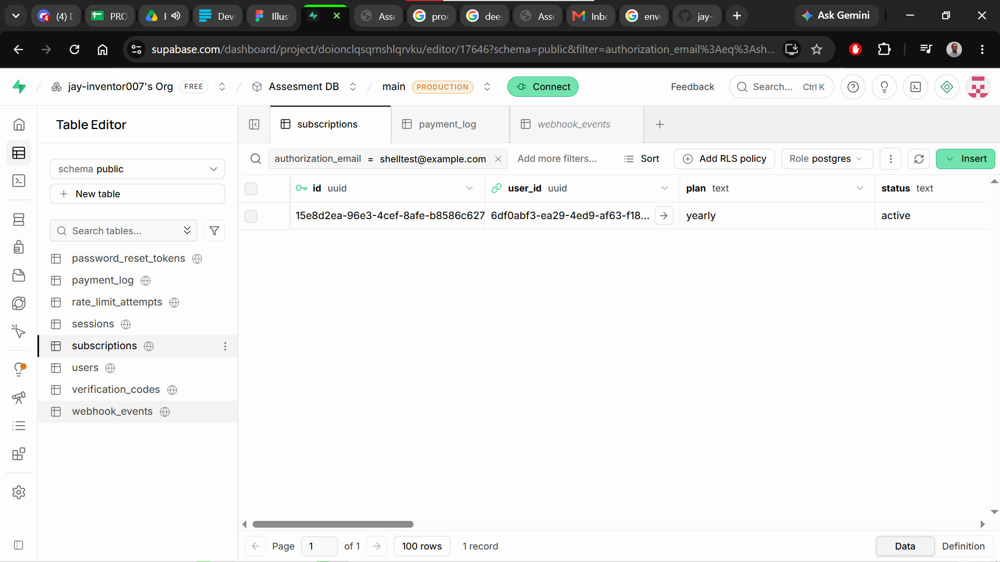

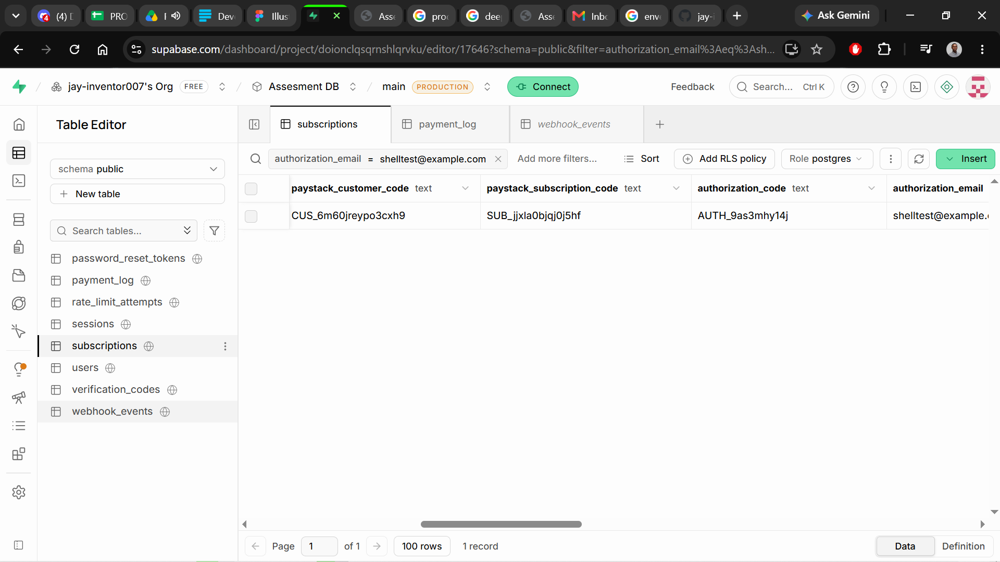

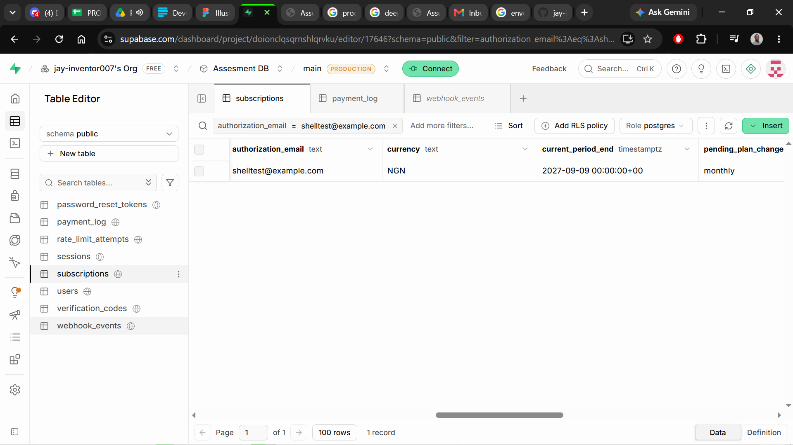

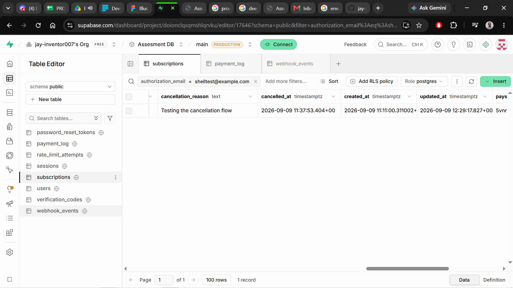

For a cleaner before/after/cancelled sequence on a single account, a second fresh test account (`primemedia2k26@gmail.com`) was run through subscribe → upgrade → cancel with a screenshot after each step. Before the upgrade, on the monthly plan:

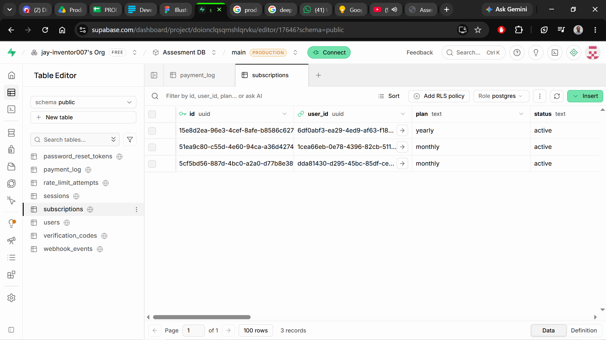

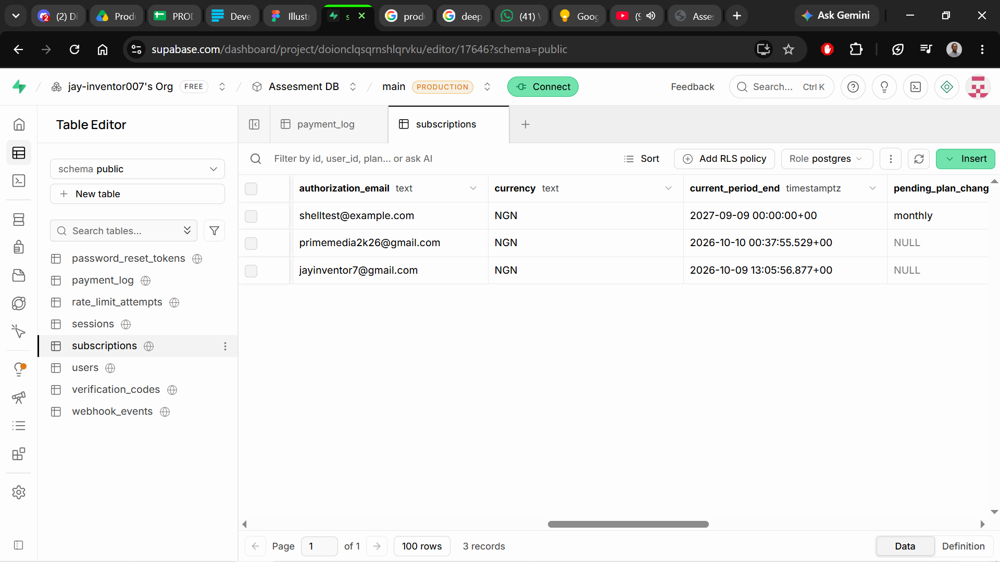

After clicking Upgrade to yearly:

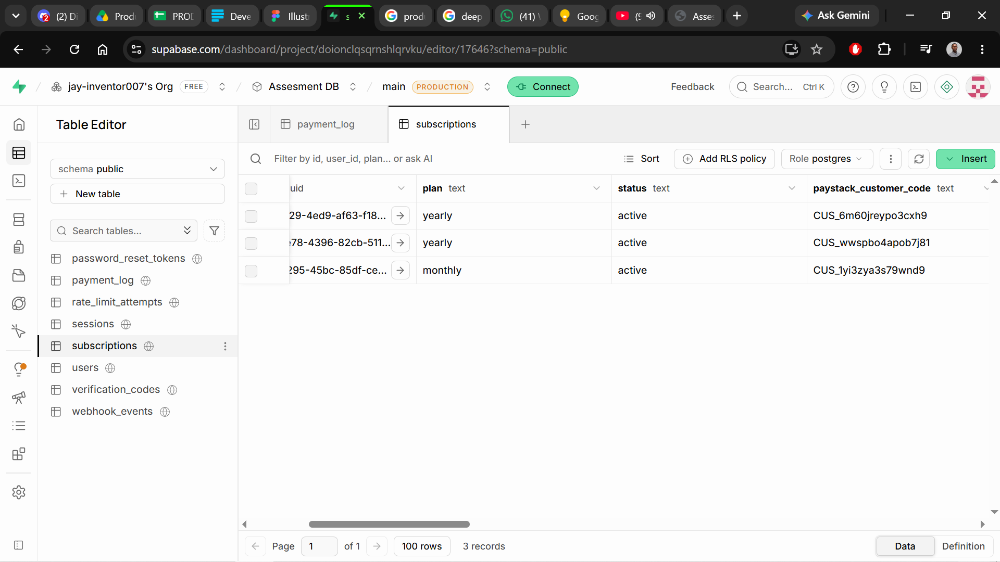

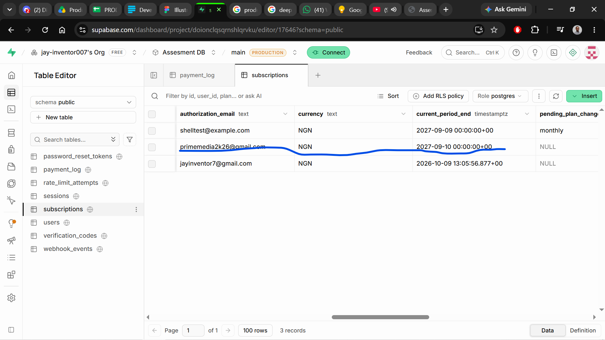

After then cancelling, with a reason given:

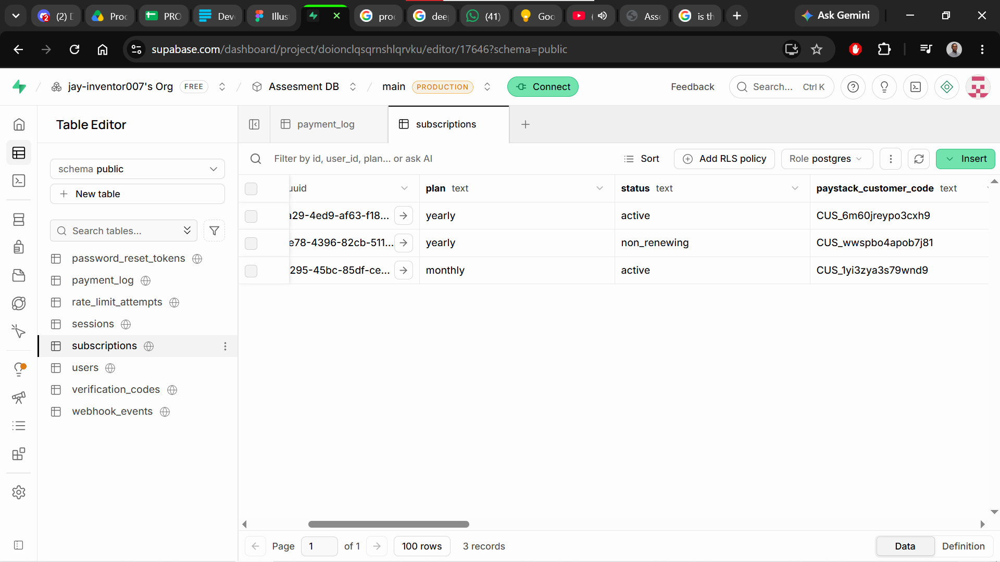

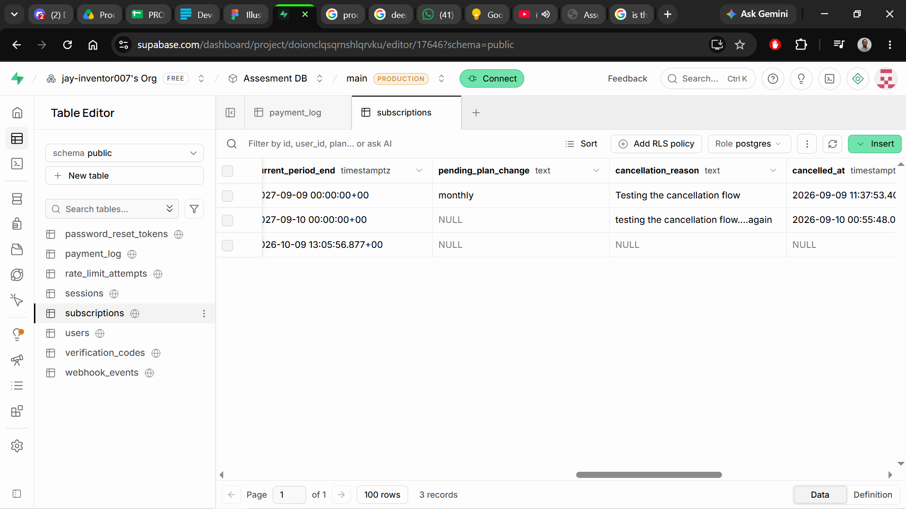

## Section 4: The Data Model

`users` and `sessions` are reused unchanged from Assessment 1 (see that repo's `DOCUMENTATION.md` for their schema); this section covers the three tables added for payments.

**`subscriptions`**, one row per user:

| column | type | why |
|---|---|---|
| `id` | `uuid primary key default gen_random_uuid()` | opaque identifier, never a guessable sequential id |
| `user_id` | `uuid not null unique references users(id) on delete cascade` | `unique` makes "a user with two subscription rows" impossible at the database level, not just something the application code avoids; `on delete cascade` means deleting a user can't leave an orphaned subscription behind |
| `plan` | `text not null check (plan in ('free','monthly','yearly'))` | the check constraint makes any other value, like a typo such as `'montly'`, physically impossible to store, not just something the frontend happens to prevent |
| `status` | `text not null default 'active' check (status in ('active','non_renewing','past_due','cancelled'))` | same reasoning; also gives every new row a sane default without every insert having to specify one |
| `paystack_customer_code`, `paystack_subscription_code`, `authorization_code`, `authorization_email` | `text`, nullable | these only exist once a payment has actually happened, so they must be nullable; `authorization_code` is Paystack's own reusable token for the saved card, never a card number, which is why storing it here doesn't put raw card data in this database at all |
| `currency` | `text not null default 'NGN'` | every row needs a currency once money is involved; amounts are meaningless without knowing which currency they're in |
| `current_period_end` | `timestamptz`, nullable | null until the first successful payment; this is the actual field entitlement checks read, not `status`, which is why cancelling can flip `status` to `non_renewing` without cutting off access early |
| `pending_plan_change` | `text check (pending_plan_change in ('monthly','yearly'))`, nullable | null except during the window between scheduling a downgrade and it actually taking effect; the check constraint stops it ever being set to something that isn't a real plan |
| `cancellation_reason`, `cancelled_at` | `text` / `timestamptz`, nullable | only meaningful after a cancellation; cleared back to null by `fulfillPayment.ts` on any fresh successful payment so a resubscribed user's billing page never shows a stale cancellation |
| `created_at`, `updated_at` | `timestamptz not null default now()` | standard bookkeeping |

**`payment_log`**, append-only, many rows per user:

| column | type | why |
|---|---|---|
| `id` | `bigint generated always as identity primary key` | plain incrementing id is fine here since, unlike `users.id`, this is never exposed as a lookup key in a URL |
| `user_id` | `uuid not null references users(id) on delete cascade` | every log entry belongs to exactly one user |
| `subscription_id` | `uuid references subscriptions(id) on delete set null` | nullable and `on delete set null` rather than cascade, since the log entry (what happened) should survive even if the subscription row it referred to is ever removed |
| `stage` | `text not null check (stage in ('initiated','verified','fulfilled','failed'))` | the check constraint is what makes an invalid lifecycle stage, like a typo, impossible to write; the four values are the only stages a payment can ever actually be in |
| `amount` | `integer`, nullable | stored in minor units (kobo), never a decimal, so there's no floating point rounding on money; nullable because a `failed` row from before Paystack replied at all may not have an amount yet |
| `currency`, `paystack_reference`, `description`, `metadata` | `text` / `text` / `text` / `jsonb`, all nullable | `paystack_reference` is what ties an `initiated`, `verified` and `fulfilled` row together into one payment's story; `metadata` holds per-stage extras like the proration numbers on an upgrade, without needing a column for every possible extra field |
| `created_at` | `timestamptz not null default now()` | rows are never updated, so this is also the only timestamp that matters |

Nothing in the application code ever updates or deletes a `payment_log` row; the append-only-ness is a convention enforced by never writing an `UPDATE`/`DELETE` against this table anywhere in the Edge Functions, not by a database-level restriction like a trigger.

**`webhook_events`**, one row per webhook delivery Paystack has sent:

| column | type | why |
|---|---|---|
| `id` | `bigint generated always as identity primary key` | same reasoning as `payment_log.id` |
| `event_type` | `text not null` | e.g. `charge.success`, `subscription.create` |
| `provider_reference` | `text not null` | the reference or subscription code the event is about |
| `payload` | `jsonb not null` | the full raw event, kept in case it's ever needed for debugging or a dispute |
| `processed_at` | `timestamptz`, nullable | null until the handler finishes; a webhook whose insert succeeded but whose handler crashed partway would be visible as a row with no `processed_at`, rather than silently looking the same as a fully handled one |
| `created_at` | `timestamptz not null default now()` | when the delivery arrived |
| `unique (event_type, provider_reference)` | table-level constraint | this is the actual idempotency mechanism: it makes storing the same webhook delivery twice impossible at the database level, so a redelivery is rejected by Postgres itself rather than relying on application code remembering to check first |

All three tables have row level security enabled with zero policies, same pattern as Assessment 1: since only the service-role key (used exclusively by Edge Functions) ever touches them, this switches off the anon-key REST API's default read/write access entirely, without needing to write and maintain per-row policies for a case that should never be reachable in the first place.

**Which constraints make an invalid state impossible:** the `unique(user_id)` on `subscriptions` makes "one user, two subscriptions" impossible; the `check` constraints on `plan`, `status` and `pending_plan_change` make an unrecognised value impossible to store, regardless of what a bug in application code might try to write; and the `unique(event_type, provider_reference)` on `webhook_events` makes processing the same Paystack delivery twice impossible, which is the actual idempotency guarantee, not just a nice-to-have.

## Section 5: The Concepts

### Minor units, and why money is never a decimal

**What it is.** Every amount in this system is stored as a whole number counting the smallest unit of the currency, kobo for naira, rather than as a decimal number of naira. 10000 in the `amount` column means 100.00 naira, not 10000.00 naira.

**Why it is needed.** Computers store decimal numbers like 100.00 as binary floating point, which cannot represent most decimal fractions exactly. Add up enough of them and the totals drift, sometimes by a fraction of a kobo, which sounds harmless until it's a subscription business reconciling thousands of charges against what Paystack actually settled and the two ledgers no longer agree to the cent. Whole numbers added to whole numbers never drift.

**How I implemented it.** `_shared/plans.ts` defines each plan's `amount` as an integer number of kobo:
```ts
export const plans = {
  monthly: { paystackPlanCode: "PLN_5xm5kn8vdy0fxrt", amount: 10000, currency: "NGN" },
  yearly: { paystackPlanCode: "PLN_c7evnexv7g4aw17", amount: 100000, currency: "NGN" },
} as const;
```
Every `payment_log.amount` and every amount Paystack is asked to charge flows from these integers; the only place a naira value with a decimal point appears is in the UI's `formatNaira`, which divides by 100 purely for display.

**What I chose against, and why.** Storing naira as a `numeric`/`decimal` column was the alternative. Postgres's `numeric` type is exact and wouldn't actually drift the way floating point does, so it was tempting, but it still needs the amount converted to Paystack's expected minor-unit integer at the API boundary, meaning the conversion has to happen somewhere either way. Keeping the whole system in minor units means there's exactly one place (`formatNaira`) that ever does a division for money, instead of a conversion step scattered across every function that talks to Paystack.

### The payment lifecycle: initiation, verification, fulfilment

**What it is.** A single payment isn't one event, it's three: initiation is "the user started a checkout," verification is "Paystack was independently asked whether that checkout actually succeeded," and fulfilment is "the subscription was actually granted because of it." Each one gets its own row in `payment_log`, tagged with `stage`.

**Why it is needed.** Collapsing these into one status column hides exactly the moment where things go wrong. If a user starts checkout and abandons it, there should be an `initiated` row and nothing else, proving the app never assumed success. If a payment is initiated but Paystack later reports it failed, there's a `failed` row showing the app checked and got a real answer, not silence. Without separate stages, "the user has no active subscription" looks identical whether they never paid, paid and it's still being verified, or paid and verification found it invalid, three completely different situations that need different explanations if a user complains.

**How I implemented it.** `checkout-init/index.ts` writes the `initiated` row before it even knows if Paystack's `/transaction/initialize` call will succeed. `verify-payment/index.ts` and `paystack-webhook/index.ts` both call the shared `fulfillPayment` (`_shared/fulfillPayment.ts`), which writes a `verified` row once Paystack confirms `status === "success"`, then a `fulfilled` row once the subscription itself has actually been updated:
```ts
await db.from("payment_log").insert({ user_id: userId, subscription_id: subscriptionId,
  stage: "verified", amount: verified.amount, currency: verified.currency,
  paystack_reference: reference });
// ...subscription update happens here...
await db.from("payment_log").insert({ ...stage: "fulfilled", ... });
```

**What I chose against, and why.** A single `payments` table with one mutable `status` column that moves from `pending` to `success` was the obvious simpler alternative. It's less code, but it destroys history: once `status` flips to `success`, there's no longer any record of what the initiated attempt looked like, or whether verification and fulfilment happened at the same moment or minutes apart. Three append-only stages cost more inserts, not more complexity, and buy back the full timeline.

### The payment log, and what it would prove in a dispute

**What it is.** `payment_log` is an append-only table: rows are inserted, and nothing in this codebase ever runs an `UPDATE` or `DELETE` against it. It's a full history of every stage of every payment attempt, separate from `subscriptions`, which only shows the current state.

**Why it is needed.** `subscriptions` answers "what plan is this user on right now." It cannot answer "did this specific payment on this specific date actually happen, and did the amount charged match what was verified." If a user disputes a charge from three months ago, a mutable status column has already been overwritten by every payment since; the log has not. Without it, the honest answer to a dispute would be "our database no longer says."

**How I implemented it.** Every function that touches a payment (`checkout-init`, `verify-payment`, `paystack-webhook`, `upgrade-subscription`, `downgrade-subscription`) inserts into `payment_log` rather than only updating `subscriptions`. For a real completed subscribe, this produces a three-row sequence (`initiated` → `verified` → `fulfilled`) with its own `created_at` timestamp and `paystack_reference`, each row showing exactly what stage happened when, for which user and amount:

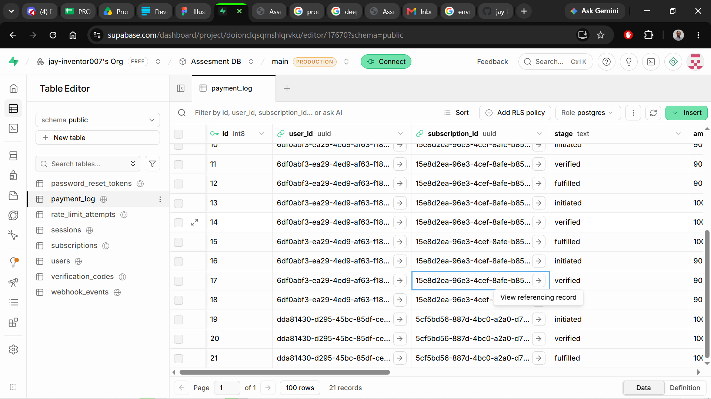

The same table scrolled to its `description` and `metadata` columns (21 real rows by the time of testing), including an actual upgrade's `description` reading "Upgraded to yearly plan, charged 90000" alongside its `metadata` of `{"plan":"yearly","credit":10000,...}`, exactly the numbers a dispute over that upgrade would need:

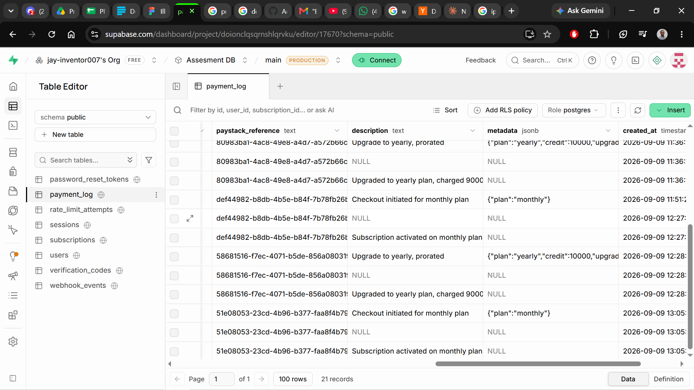

**What I chose against, and why.** I considered only logging failures, since successes are already reflected in `subscriptions`. I rejected that because a dispute needs to see the successful path too, proof that a specific amount was verified and matched what was charged, not just proof that failures get noticed.

### Idempotency in payments

**What it is.** Idempotency means doing the same operation more than once has the same effect as doing it once. Here it applies to two different repeats: verifying or fulfilling the same payment reference twice, and receiving the same webhook delivery twice.

**Why it is needed.** Paystack's webhook can be redelivered (network retries, timeouts on their side), and this app calls the same `fulfillPayment` logic from both the webhook and the return-view path, so it can run twice for the same real payment. Without a guard, a redelivered webhook or a race between those two paths could grant a second billing period, extend `current_period_end` twice, or double-log the same money as if it were two separate payments.

**How I implemented it.** Two layers. First, `webhook_events` has a `unique(event_type, provider_reference)` constraint; a redelivered webhook's insert fails with Postgres error `23505` and is treated as already handled:
```ts
if (insertError) {
  if (insertError.code === "23505") {
    return new Response(JSON.stringify({ message: "Already processed" }), { status: 200 });
  }
  throw insertError;
}
```
Second, `fulfillPayment.ts` checks for an existing `fulfilled` row for that `paystack_reference` before granting anything, so even the webhook and the return-view path racing each other only ever grants once. Real evidence of both layers: re-verifying an already-fulfilled reference through `verify-payment` returned `{"granted":true,"reason":"Already fulfilled"}` with no new rows written, and separately, replaying a real `charge.success` webhook's exact payload (correctly signed) directly against `paystack-webhook` twice in a row returned `{"message":"Already processed"}` both times, at the `webhook_events` insert stage, before `fulfillPayment` was ever reached again.

**What I chose against, and why.** I could have relied only on the `webhook_events` unique constraint and skipped the second check in `fulfillPayment`, since that's the layer the brief explicitly asks for. I kept both because the webhook and the return-view path aren't the same code path receiving the same request twice, they're two different Paystack-facing entry points that can both legitimately fire for one real payment; the constraint alone only protects against the webhook repeating itself, not against the two paths racing each other.

There's a third case neither of those two layers catches: two genuinely separate checkouts for the same plan, each with its own real Paystack reference, started a minute apart. Per-reference idempotency doesn't apply, since they're different references, both would succeed as real payments, and without a guard the second `fulfillPayment` call would just reset `current_period_end` to a year from the second payment's time rather than extending it, charging twice for one year of access. `checkout-init/index.ts` now checks for this case directly, before a second checkout is even allowed to start:
```ts
if (existingSubscription && existingSubscription.plan !== "free" && existingSubscription.status === "active") {
  return json(req, { error: "You already have an active subscription. Use upgrade, downgrade or cancel instead." }, 409);
}
```

### Webhook signature verification

**What it is.** Paystack sends an HMAC-SHA512 hash of the raw request body, computed with the account's secret key, in the `x-paystack-signature` header. Verifying it means recomputing that same hash myself and checking it matches before trusting anything in the payload.

**Why it is needed.** The webhook URL is a public endpoint. Without signature verification, anyone who found that URL could POST a fake `charge.success` event with someone else's email and grant themselves a paid subscription for free, no card, no money, just a crafted HTTP request.

**How I implemented it.** `paystack-webhook/index.ts` reads the raw body with `req.text()` (not `req.json()`, since the signature is computed over the exact raw bytes) and compares it against a signature computed with `_shared/webhookSignature.ts`:
```ts
const rawBody = await req.text();
const signature = req.headers.get("x-paystack-signature");
const expectedSignature = await hmacSha512Hex(secretKey, rawBody);
if (!signature || expectedSignature !== signature) {
  return new Response(JSON.stringify({ error: "Invalid signature" }), { status: 401 });
}
```
This check runs before the body is parsed as JSON or anything is written to the database.

**What I chose against, and why.** I didn't consider skipping verification an option, Paystack's own docs are explicit that an unverified webhook must not be trusted, so this wasn't a choice between alternatives, it was a requirement. The one real decision was where to check it: before parsing the JSON, using the raw string, rather than parsing first and hashing a re-serialized version of it, since re-serializing JSON can change whitespace and key order and produce a different hash than Paystack actually sent.

### Proration on a mid-cycle upgrade

**What it is.** Proration means charging only for the portion of a new billing period that reflects the value not yet used on the old one, rather than charging the full new price on top of a price already paid.

**Why it is needed.** Without it, upgrading from monthly to yearly ten days into a month the user already paid for would charge the full yearly price on top of that unused time, effectively charging twice for the same days. That's the kind of thing that gets a subscription business a chargeback and a bad review.

**How I implemented it.** `upgrade-subscription/index.ts` works out how many days are left in the current monthly period, turns that fraction of the monthly price into a credit, and subtracts it from the yearly price:
```ts
const totalPeriodDays = (periodEnd.getTime() - periodStart.getTime()) / MS_PER_DAY;
const daysRemaining = Math.max(0, (periodEnd.getTime() - now.getTime()) / MS_PER_DAY);
const creditFraction = totalPeriodDays > 0 ? daysRemaining / totalPeriodDays : 0;
const credit = Math.round(monthlyAmount * creditFraction);
const amountToCharge = Math.max(0, yearlyAmount - credit);
```
Real numbers from an actual test, upgrading with essentially the full monthly period still remaining (30-day period, 29.999988 days left, since the test ran seconds after subscribing): `totalPeriodDays` = 30, `daysRemaining` = 29.999988, `creditFraction` ≈ 0.9999996, `monthlyAmount` = 10000 kobo, so `credit` = round(10000 × 0.9999996) = 10000, and `amountToCharge` = 100000 − 10000 = 90000. The function returned exactly that: `{"plan":"yearly","amountCharged":90000,"credit":10000,"daysRemaining":29.999988}`. A second real test on a different account, upgrading about 8 minutes after subscribing instead of seconds after, produced slightly different but equally consistent numbers: credit ₦99.98 (9998 kobo) and amount charged ₦900.02 (90002 kobo), i.e. ₦1000.00 − ₦99.98, confirming the day-based fraction genuinely shifts with real elapsed time rather than being a fixed number.

**What I chose against, and why.** Paystack has no built-in "change this subscription's plan with proration" call, confirmed by reading through the PaystackOSS SDK source on GitHub rather than assuming, so there was no provider-side shortcut to take instead. The alternative within my own code was charging the full yearly price and letting the user "lose" the unused monthly days, which is simpler but is exactly the double-charging problem above; I chose to do the day-level arithmetic myself instead.

### Cancellation and period-end access

**What it is.** Cancelling stops a subscription from renewing, but the user keeps access until the period they already paid for actually ends, rather than losing access the moment they click cancel.

**Why it is needed.** The user already paid for the full period. Cutting off access immediately on cancellation would mean keeping money for days or months of service never delivered, which is the same problem an unfair refund policy has, just from the opposite direction. Reading access off `current_period_end` rather than off `status` is also what stops a bug: `status` changes to `non_renewing` at the moment of cancelling, but the date it's still allowed until does not change.

**How I implemented it.** `cancel-subscription/index.ts` disables the underlying Paystack subscription (so it can't auto-renew) and sets `status` and `cancellation_reason`, but explicitly leaves `current_period_end` untouched:
```ts
.update({
  status: "non_renewing",
  cancellation_reason: parsed.data.reason ?? null,
  cancelled_at: new Date().toISOString(),
  pending_plan_change: null,
  updated_at: new Date().toISOString(),
})
```
The billing page reads `current_period_end` to show "Access until" rather than treating `non_renewing` as "access ends now." The frontend also requires a confirmation click before calling this endpoint, and offers an optional reason field that populates `cancellation_reason`. Real evidence: `docs/evidence/cancellation-clean-status.png` and `docs/evidence/cancellation-clean-detail.png` show a subscription immediately after cancelling, `status` changed to `non_renewing` but `current_period_end` still a year out, exactly as it was before cancelling, alongside the populated `cancellation_reason` and `cancelled_at`.

**What I chose against, and why.** Immediate cutoff on cancel was the simpler alternative, one fewer date to reason about, but it's the exact trap the brief calls out: taking payment for a period and then not delivering the part of it that hasn't happened yet.

### Why cards are never stored (PCI scope)

**What it is.** PCI DSS is the security standard that applies to anyone who stores, processes, or transmits card numbers. PCI scope refers to which systems fall under those obligations. This app never touches a raw card number at all, so it carries none of that scope.

**Why it is needed.** Storing card numbers directly would mean this small assessment project has to meet bank-grade security requirements, encrypted storage, restricted access, regular audits, none of which it has or needs. Getting that wrong doesn't just risk a bug, it risks real card numbers leaking.

**How I implemented it.** Card entry happens entirely inside Paystack's own hosted checkout page (`authorizationUrl` from `checkout-init`, opened via `window.location.href` in `PlansPage.tsx`); this app's own frontend never renders a card input. What comes back afterward is Paystack's own reusable `authorization_code`, stored in `subscriptions.authorization_code`, which can be used to charge the same card again (as `upgrade-subscription` does) without this app ever seeing the card number behind it.

**What I chose against, and why.** Building a custom card form was never really an option worth taking, it would mean handling raw card numbers directly, putting this project's own servers in full PCI scope for no benefit over Paystack's hosted page, which already handles that compliance burden.

### Rate limiting on payment endpoints

**What it is.** Rate limiting caps how many times a given identifier (here, a signed-in user's id) can call a route within a time window, rejecting further attempts until the window resets.

**Why it is needed.** `checkout-init` calls Paystack's API and writes a database row on every call. Without a limit, a compromised session or a scripted retry loop could hammer that endpoint, generating large numbers of Paystack API calls and `payment_log` rows for a single account in seconds, real cost and log noise for something a person could never legitimately do that fast.

**How I implemented it.** `checkout-init/index.ts` calls the same `enforceRateLimit` helper and shared `check_rate_limit` Postgres function reused from Assessment 1's auth routes, keyed on `user.id` rather than IP since this route can only be reached by an authenticated user:
```ts
const limited = await enforceRateLimit(db, req, "checkout-init", user.id);
if (limited) return limited;
```
configured in `_shared/rateLimits.ts` as 10 attempts per 15 minutes. A limited request gets a `429` with a `Retry-After` header stating the real number of seconds until the window resets, rather than a made-up fixed delay.

**What I chose against, and why.** Rate limiting by IP address, the same key used for the unauthenticated auth routes, was the alternative. I rejected it here because `checkout-init` requires a session, so the account itself is a more meaningful and harder-to-evade identifier than an IP address, which can change or be shared across many real users behind the same network.

## Section 6: What Went Wrong

**Downgrading would have auto-renewed the old subscription at the old price.** While testing the downgrade flow, `downgrade-subscription` only set `pending_plan_change: "monthly"` on the subscription row and returned success, without touching the actual subscription on Paystack's side. Tracing through what would happen next: Paystack subscriptions renew on their own schedule regardless of what this app's own database says, so the still-active yearly Paystack subscription would have simply billed and renewed itself at the yearly price when the period ended, the exact opposite of what downgrading is supposed to do. Comparing against `cancel-subscription`, which did call `/subscription/disable`, made the missing piece obvious. Fixed by adding the same `/subscription/disable` call to `downgrade-subscription/index.ts` before setting `pending_plan_change`, so the old subscription can never renew itself again, while `current_period_end` stays untouched so access continues until the period already paid for actually ends.

**`webhook_events` stayed empty after a real successful payment.** After completing a real Paystack test-mode payment, `verify-payment` correctly granted access, but `webhook_events` had zero rows, even though webhook-driven fulfilment and the subscription-code lookup both depend on it. First suspected `webhookSignature.ts` was silently rejecting a valid signature, so checked the Edge Function logs for `paystack-webhook`, expecting to find a rejected request there. There wasn't one: the function had never been invoked at all, which ruled out a signature bug entirely, since the code that would reject a bad signature never ran. The actual cause was simpler and outside the code: the webhook URL had never been entered into the Paystack dashboard, so Paystack had nowhere to send the event. Fixed by setting the webhook URL under Settings -> API Keys & Webhooks, then repeating a real payment and confirming a row appeared with a populated `processed_at`.

**A fresh subscription could still show a stale cancellation reason.** While testing downgrade shortly after an earlier cancellation test on the same account, the billing page showed a `cancellation_reason` left over from that earlier test, even though the subscription had since been paid for again and was active. Checked `cancel-subscription`, which correctly writes `cancellation_reason` on cancel, and then `fulfillPayment.ts`, which runs on every successful payment. The cause was that nothing ever cleared those columns back out; once set, they persisted across any number of later successful payments. Fixed by adding `cancellation_reason: null, cancelled_at: null` to the subscription update inside `fulfillPayment.ts`, so a fresh grant always clears out any earlier cancellation.

**Paying for the same plan twice would have silently absorbed the extra money.** While preparing the documentation's defence answer for "what happens if a user pays for yearly twice in one minute," walking through the actual code rather than assuming it was handled revealed a real gap: the per-reference idempotency check in `fulfillPayment` only catches the *same* Paystack reference being processed twice, such as the webhook and the return-view page racing each other. A second real payment gets its own separate reference, so a second `checkout-init` call while already subscribed would go through untouched, and the second `fulfillPayment` run would reset `current_period_end` to one year from the second payment's time rather than extending it, charging twice for one year of access rather than two. The cause was that `checkout-init` never checked the caller's existing subscription state before starting a new checkout at all. Fixed by adding a check at the top of `checkout-init/index.ts` that rejects the request with 409 if the user already has an active paid plan, directing them to upgrade, downgrade or cancel instead.

## Section 7: What This Slice Does Not Handle

Outside the brief, on purpose: no refund flow (a dispute would still be resolved manually through the Paystack dashboard, `payment_log` only tells you what to refund, not how), no plan pause, no support for more than one paid plan family or more than one currency (`_shared/plans.ts` is a hardcoded map of exactly two plans; adding a third means editing code and redeploying, not a database row), and no admin view across all users' subscriptions or payment history, only a single signed-in user's own billing page.

Known but not fully closed, ran out of scope to chase further: the "check-on-access" design for a scheduled downgrade (`applyPendingPlanChangeIfDue`, called from `billing-status`) only actually switches the plan and charges the new price the next time that user's own billing status is read. A user who downgrades and then never opens `/billing` again keeps their old plan's status in the database indefinitely past `current_period_end`, technically still `pending_plan_change: "monthly"` with no trigger ever firing to apply it, until they happen to load that page. A real product would need this on a schedule (a cron-triggered Edge Function, not a page load) rather than relying on the user's own next visit. Similarly, deleting a `users` row cascades and deletes that user's entire `payment_log` history along with it (`user_id uuid not null references users(id) on delete cascade`); for a real business this is in tension with the payment log's whole purpose of surviving as dispute evidence, and would need account deletion to archive or anonymize payment history rather than delete it outright.

## Section 8: If I Built This Again

The single biggest thing I'd change is the check-on-access pattern for applying a scheduled downgrade. It was the right call to avoid needing a background job scheduler for a slice this size, but it quietly ties correctness to the user actually reloading their billing page, which means a downgrade that should have taken effect can sit unapplied indefinitely with nothing visibly wrong, no error, no failed job, just a date that's already passed and a plan that hasn't actually changed yet. I'd build it as a small scheduled Edge Function instead (Supabase supports cron-triggered functions), checked once a day for any subscription whose `pending_plan_change` is set and `current_period_end` has passed, so the switch happens on a schedule that doesn't depend on which page a user happens to open next.
